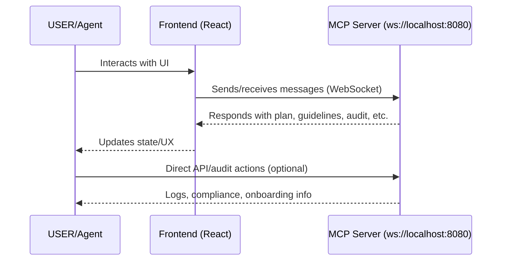
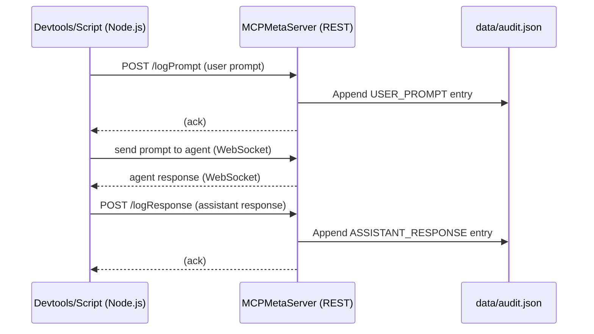

> **⚠️ PROJECT REWRITE NOTICE (2025-04-15):**
>
> This repository was completely rewritten from scratch on April 15, 2025. All previous code, structure, and documentation have been replaced with a new, MCP-compliant foundation focused on:
> - Automated compliance audit for tests/mocks
> - Conversational logging for auditability
> - Modern onboarding and agentic workflow
>
> Please see below for the current project structure, compliance requirements, and onboarding instructions.

# Moody’s Underwriting Assistant (MUA)

**MUA** (Moody’s Underwriting Assistant) is an interactive frontend prototype designed to help commercial casualty underwriters manage and analyze insurance submissions efficiently. This project is developed with a strict **UX-first, front-to-back approach** and is structured for easy extension into a full-stack application.

---

## Development Phases

**This project is intentionally developed in clear, auditable phases:**

1. **Phase 1: UX & User Journey Development (Current Focus)**
    - Build the entire frontend with mock data.
    - Document user journeys in `docs/user-journeys/` (recommended).
    - Validate UX with stakeholders before backend work.
2. **Phase 2: Backend & Data Integration (Future)**
    - Implement backend services and APIs.
    - Replace mock data with real API calls.
    - Ensure robust error handling and data integrity.
3. **Phase 3: Advanced Features & Optimization (Future)**
    - Add authentication, roles, analytics, accessibility, and security features.
    - Optimize performance and deploy to production.

---

## Getting Started

1. **Clone the repository:**

   ```bash
   git clone https://github.com/yourusername/mua.git
   cd mua
   ```

2. **Install dependencies:**

   ```bash
   npm install
   ```

3. **Run the app:**

   ```bash
   npm run dev
   ```

4. **Open in browser:**
   - Visit `http://localhost:3000` (or as indicated in terminal)

---

## UX-First Workflow

- **Document user journeys** in `docs/user-journeys/` for every feature/screen.
- **Start with mockups/wireframes** (Figma, XD, or hand-drawn) before coding.
- **Build UI with mock data** (see `mockData.json`).
- **Validate with stakeholders** before backend work.
- **Iterate on UX** based on feedback.

---

## Project Structure & Naming Conventions

```text
mua/
├── src/
│   ├── components/           # UI components (tables, modals, etc)
│   ├── screens/              # Page-level components (Dashboard, Dossier)
│   ├── hooks/                # Custom React hooks
│   ├── context/              # React context providers (state management)
│   ├── devtools/             # MCP protocol dev/automation code (not user-facing)
│   └── ...
├── mockData.json             # Main mock data powering the UI
├── public/                   # Static assets
├── MCP_SETUP.md              # General onboarding for MCP protocol (for devs/agents)
├── README.md                 # This file
└── ...
```

**Naming Conventions:**
- Components: PascalCase (e.g., `UserDashboard.tsx`)
- Hooks/Services/Utils: camelCase (e.g., `useAuth.ts`, `apiClient.ts`)
- Tests: Match source file with `.test` suffix (e.g., `UserDashboard.test.tsx`)
- CSS: Kebab-case (e.g., `user-dashboard.css`)
- Use descriptive, UX-driven names (e.g., `SubmitButton.tsx`)

---

## Dependency & Configuration Management

- All dependencies are explicitly listed and version-pinned in `package.json`.
- Node.js version is locked with `.nvmrc` (add this file if missing).
- **Environment Variables:**
    - Document all required variables in `.env.example`.
    - Use `.env` for local development, `.env.production` for production.
    - Update README.md if new variables are added.

---

## Design System & UI Standards

- **Shared Components:** Place all reusable UI elements in `src/components/shared/`.
- **Design Tokens:** Document colors, spacing, and typography in a `design-tokens.md` (recommended) or in code comments.
- **Storybook:** Use Storybook for documenting and visually testing shared components (optional, but recommended).
- **Consistent Styling:** Use Tailwind CSS utility classes and/or CSS Modules for all components.

---

## Testing Guidelines

- All tests live in `src/__tests__/` and use Jest + React Testing Library.
- Mocks for tests go in `src/__tests__/test-utils/mocks/` (see project memory for detailed structure).
- Use `data-testid` for all interactive elements.
- Test both success and error cases for all components.
- Aim for 80%+ coverage on critical paths.

---

## Version Control & PR Workflow

- **Branching:**
    - `main`: Production-ready code
    - `develop`: Integration branch
    - `feature/<name>`: New features
    - `bugfix/<name>`: Bug fixes
- **Commit Messages:**
    - Format: `type(scope): message` (e.g., `feat(dossier): add risk detail modal`)
- **PR Template:**
    - Describe what/why, link to user journey, checklist for tests/linting
- **Pre-commit Hooks:**
    - Use Husky and lint-staged to enforce linting/formatting

---

## Error Handling & API Integration (For Future Phases)

- All API calls should use a central `apiClient.ts` with robust error handling.
- Show user-friendly messages for all errors.
- Use React Error Boundaries for critical UI sections.
- Backend: Use FastAPI (or similar) with global and endpoint-specific error handlers.

---

## Containerization & Tooling

- **Docker:** Add Dockerfiles for dev and production environments (recommended for Phase 2+).
- **Linting & Formatting:**
    - Use `.eslintrc`, `.prettierrc` for consistent code style.
    - Document IDE setup (recommended extensions, settings) in `docs/ide-setup.md`.
- **Scripts:**
    - Add helpful scripts to `package.json` (e.g., `lint`, `format`, `test`).

---

## Screens & UX Flows

### 1. Dashboard Screen
- Table of all submissions (mock data)
- Columns: Insured Name, Submission ID, Status, Risk Score, Date Received, Broker
- Sort/filter UI (visual only)
- Click row → Submission Dossier

### 2. Submission Dossier Screen
- Header: Insured Name, Submission ID, Status, action buttons (visual only)
- Tabbed/accordion navigation: Summary, Risk Analysis, Quote Recommendation, Documents (placeholder), History/Log (placeholder)
- All sections populated from mock data
- Clickable risk/quote components for detail views

### 3. "Ask MUA" Interaction
- Persistent button on Dossier screen
- Modal/sidebar shows Q&A log (from `interactionLog` in mock data)
- Click suggested question → show answer
- Disabled input for future typing

---

## MCP Server (Backend) Setup & Troubleshooting

### Starting the MCP Server

1. **Ensure you are using the correct Node.js, TypeScript, and ts-node versions:**
   - Node.js: v18.x or later (see .nvmrc if present)
   - TypeScript: latest (see package.json)
   - ts-node: latest (see package.json)

2. **Install dependencies:**
   ```bash
   npm install
   ```

3. **Start the MCP server:**
   ```bash
   node --loader ts-node/esm src/mcp/server/index.ts
   ```
   - You should see:
     ```
     [MCPServer] WebSocketServer started on ws://localhost:8080
     MCP server started at ws://localhost:8080
     ```
   - If you see errors about loaders or ESM, ensure ts-node and TypeScript are up to date and that your tsconfig.json uses `module` and `moduleResolution` set to `NodeNext`.

4. **Shut down the server:**
   - Press `Ctrl+C` in the terminal; you should see `Shutting down MCP server...`.

### Troubleshooting
- **ExperimentalWarning:** This is expected due to Node’s loader API. It does not affect functionality but may change in future Node versions.
- **Port in use:** Run `lsof -i :8080` and `kill <PID>` to free the port.
- **Cannot find module errors:** Ensure all paths and aliases are correct and that `tsconfig.json` is properly configured.
- **No startup log:** Ensure the entrypoint logs are present as shown above.
- **Frontend not connecting:** Confirm the frontend is using `ws://localhost:8080` as the MCP WebSocket endpoint.

### Auditability & Compliance
- All MCP server actions, prompts, and responses are logged in `data/audit.json`.
- See the [MCP_SETUP.md](./MCP_SETUP.md) for protocol, audit, and onboarding details.

---

## Logic Flow Diagram (Updated)



---

## Recent Architectural Decisions & Rationale

- **MCP server is now started via Node/ts-node ESM loader for full TypeScript + ESM support.**
- **All startup, error, and shutdown events are logged for auditability and onboarding.**
- **All contributors should check README.md and MCP_SETUP.md for up-to-date onboarding and compliance instructions.**

---

## MCP-Driven Compliance Audit Tool

This project includes an automated compliance audit script to ensure your directory structure and naming conventions match project guidelines and documentation.

### Usage

Run the audit tool from the project root:

```bash
node src/devtools/auditCompliance.mcp.cjs
```

- The script checks for required directories, files, and naming conventions (PascalCase for components, camelCase for hooks like `useXyz.ts`).
- Results are logged to `data/audit.json` for traceability.
- Exit code is `0` for pass, `1` for fail (useful for CI).

### Expanding/Customizing Rules

- Edit `data/guidelines.json` or the audit script to add or refine checks (e.g., for docs, tests, additional conventions).
- Audit results are always appended to `data/audit.json` for auditability.

### Example Output

```
MCP Compliance Audit Result: PASSED
All checks passed.
```

or

```
MCP Compliance Audit Result: FAILED
Component/hook file does not follow naming convention: useMCP.ts
```

---

## Conversational Logging (MCP)

Every user prompt and assistant (Cascade) response is logged in `data/audit.json` for full auditability and compliance:

- `type`: `USER_PROMPT` or `ASSISTANT_RESPONSE`
- `actor`: `USER` or `Cascade`
- `content`: The prompt or response
- `timestamp`: ISO format

### How it Works
- **REST Endpoints:** MCPMetaServer provides `/logPrompt` and `/logResponse` endpoints for logging.
- **Utilities:**
  - `src/devtools/useMCP.ts`: For ESM/TypeScript devtools/agentic workflows.
  - `src/devtools/useMCP.cjs`: For Node.js/CommonJS scripts (e.g., integrationTest.mcp.cjs).
- **Integration:**
  - In devtools/test scripts, call `logUserPrompt` before sending a prompt and `logAssistantResponse` after receiving a response.
  - Example: See `integrationTest.mcp.cjs` for a fully wired agentic audit trail.
- **Purpose:**
  - Ensures all agentic actions are traceable for onboarding, compliance, and reproducibility.
  - Required for Cascade (Windsurf coding agent) and all MCP-enabled automation.

### Logic Flow Diagram (Conversational Logging)



---

## Audit/Compliance File Purposes

- `src/devtools/useMCP.ts`: TypeScript/ESM logging utility for devtools/agentic workflows.
- `src/devtools/useMCP.cjs`: CommonJS logging utility for Node.js scripts.
- `integrationTest.mcp.cjs`: Example of full conversational logging in agentic integration tests.
- `data/audit.json`: Audit log for all MCP actions, prompts, and responses.

---

## About the MCP Protocol (Developer/Automation Layer)

**MCP** is a developer/automation protocol used in this project for audit, agentic workflows, and compliance. It is NOT a user-facing feature and does not affect the MUA product UI or logic.

- See [`MCP_SETUP.md`](./MCP_SETUP.md) for a reusable onboarding and protocol guide if you want to add MCP to your own project, or to automate/track agentic workflows here.
- MCP files live in `src/devtools/` and `mcp/` directories.
- For most contributors, you do NOT need to interact with MCP to work on the MUA app.

---

## Using This Project as a Template (with MCP)

- To use MUA as a template for your own MCP-enabled project:
  1. Copy `MCP_SETUP.md` and `MCP_TEMPLATE_PROJECT.md`.
  2. Adapt the directory structure and onboarding as needed.
  3. Implement your application logic in `src/`.
  4. Use MCP only if you want agentic audit/compliance features.

---

## Changelog & Documentation Process

- All major changes are documented in this README.md and MCP_SETUP.md.
- README.md is the source of truth for project structure, UX, and rationale.
- See project process memories for documentation and testing best practices.

---

## License

This project is licensed under the MIT License. See LICENSE for details.

---