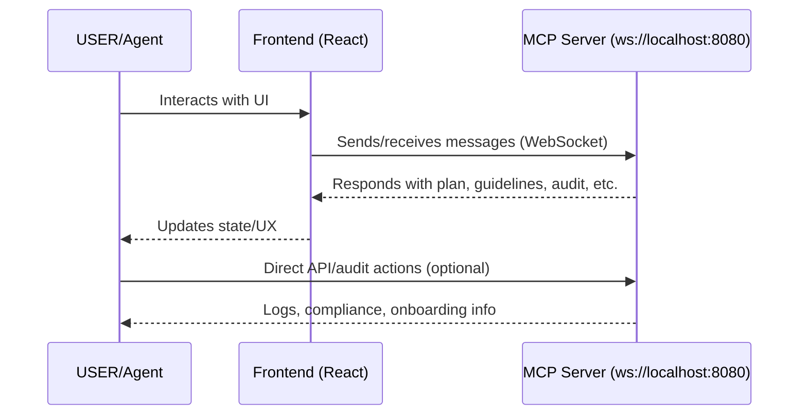

# MCP (Model Context Protocol) – General Setup & Onboarding Guide

---

## Overview

The Model Context Protocol (MCP) is a meta-brain architecture for project management, agent orchestration, and auditability. It enables:

- A single source of truth for project plan, guidelines, and audit log
- Enforced protocol for agent and human actions (pre- and post-change logging)
- REST and WebSocket endpoints for easy integration
- Full traceability and compliance for agentic and collaborative development

**This guide is a reusable template for wrapping any project with an MCP server.**

---

## When to Use MCP

- You want to log, track, and guide all codebase changes (by humans or agents)
- You need a protocol for auditability and compliance
- You want to enforce project guidelines and plans
- You want to expose project meta-data (plan, guidelines, audit, README, structure) via API

---

## Directory Structure (Reference)

```text
<your-project>/
├── mcp/                # MCP implementation (server, types, utils)
│   ├── server/         # MCPMetaServer and related logic
│   ├── types/          # Protocol types, enums, interfaces
│   ├── utils/          # Validation, logging, helpers
├── data/               # Project meta-data (plan.json, guidelines.json, audit.json)
├── src/                # Application source code (optional)
├── README.md           # Project-specific documentation
├── MCP_SETUP.md        # This onboarding guide (copy & adapt for your project)
└── ...                 # Other project files
```

---

## Node.js Module System: CommonJS vs ESM (UPDATED)

### What Changed?
- The project now uses **CommonJS** for all backend/server code.
- All local imports use the CommonJS-compatible form (no `.js` extensions, just the module name).
- This avoids ESM/TypeScript loader errors and makes development and onboarding easier.

### Why CommonJS?
- CommonJS is the most widely supported and reliable module system for Node.js projects.
- ESM (ECMAScript Modules) is more modern, but can be tricky to set up in Node.js, especially with TypeScript.
- For most backend/server code, there is no practical difference for developers.
- If you ever need to switch to ESM in the future (for package publishing or browser compatibility), see the [project history](#project-history) for migration notes.

### What Do I Need To Do?
- Use `import ... from '...'` for all imports, but do **not** add `.js` extensions to local files.
- Run the server with:
  ```bash
  npx ts-node src/mcp/server/index.ts
  ```
- You do **not** need to worry about ESM vs CommonJS unless you hit a specific package compatibility issue.

### Troubleshooting
If you see errors about unknown file extensions or ESM loaders, make sure:
- `package.json` contains: `"type": "commonjs"`
- `tsconfig.json` contains: `"module": "commonjs"`
- All local imports omit the `.js` extension (e.g., `import foo from './foo'` not `import foo from './foo.js'`)

---

## Quickstart Checklist (UPDATED)

1. **Clone your project & install dependencies**
   ```bash
   git clone <your-repo-url>
   cd <your-project>
   npm install
   ```
2. **Add/verify MCP directories and files**
   - Place all MCP files in `mcp/` or `data/`.
   - Create `data/plan.json`, `data/guidelines.json`, `data/audit.json` as needed.
3. **Start the MCP Server (Unified Startup)**
   ```bash
   npx ts-node src/mcp/server/index.ts
   ```
   - This starts both the WebSocket server (8080) and REST audit server (8081).
   - You should see logs like:
     ```
     [MCPServer] WebSocketServer started on ws://localhost:8080
     MCP server started at ws://localhost:8080
     [MCPMetaServer] REST server running on http://localhost:8081
     ```
   - If you see loader/ESM errors, double-check that your project is configured for CommonJS (see above).
4. **Test Endpoints (REST API)**
   ```bash
   curl http://localhost:8081/plan
   curl http://localhost:8081/guidelines
   curl http://localhost:8081/audit
   curl http://localhost:8081/readme
   curl http://localhost:8081/structure
   ```
5. **Log an Action to the Audit Log**
   ```bash
   curl -X POST http://localhost:8081/audit -H "Content-Type: application/json" -d '{"actor": "YOUR_NAME","action": "TEST_ACTION","component": "MCPMetaServer","rationale": "Testing audit log."}'
   ```
6. **Review Audit Log**
   ```bash
   curl http://localhost:8081/audit | jq .
   ```

---

## MCP Server (Backend) Setup & Troubleshooting (UPDATED)

### Starting the MCP Server

1. **Install dependencies:**
   ```bash
   npm install
   ```
2. **Start the MCP server (Unified Startup):**
   ```bash
   npx ts-node src/mcp/server/index.ts
   ```
   - You should see logs like:
     ```
     [MCPServer] WebSocketServer started on ws://localhost:8080
     MCP server started at ws://localhost:8080
     [MCPMetaServer] REST server running on http://localhost:8081
     ```
   - If you see loader/ESM errors, double-check that your project is configured for CommonJS (see above).

3. **Shut down the server:**
   - Press `Ctrl+C` in the terminal; you should see `Shutting down MCP server...`.

### Troubleshooting
- **ExperimentalWarning:** This is expected with Node’s loader API and does not affect functionality.
- **Port in use:** Run `lsof -i :8080` or `lsof -i :8081` and `kill <PID>`.
- **Cannot find module:** Check all import paths and tsconfig.json.
- **No startup log:** Ensure logging is present in `src/mcp/server/index.ts`.
- **Frontend not connecting:** Confirm frontend uses `ws://localhost:8080`.
- **Unknown file extension or ESM loader error:** Ensure you are using CommonJS (see above).

---

## Project Structure (UPDATED)

- `src/mcp/server/index.ts`: Unified entrypoint. Starts both servers. **Only run this file.**
- `src/mcp/server/MCPServer.ts`: WebSocket protocol server (8080).
- `src/mcp/server/MCPMetaServer.ts`: Express REST server (8081) for audit/compliance. Exported as an app, not run directly.
- `README.md`: Project-specific documentation and compliance notes. Always keep in sync with this file.

---

## Protocol Workflow (General)

1. **Before any codebase change:**
   - Query `/plan`, `/guidelines`, `/audit`, `/readme`, and `/structure`.
   - Log intended action (with rationale) to `/audit`.
2. **After change:**
   - Log completion and outcome to `/audit`.
   - Ensure all changes are reflected in the plan and audit log.

### Logic Flow Diagram



---

## Best Practices

- **Keep README.md and MCP_SETUP.md in sync.**
- **Never modify files in `data/` directly—always use the server endpoints.**
- **Log all actions and rationale for full auditability.**
- **Document component purposes, relationships, and rationale in your project README.**
- **Update documentation with every protocol or structural change.**
- Always check README.md and MCP_SETUP.md for onboarding and compliance before making changes.
- All server actions and audit logs are in `data/audit.json` for traceability.
- Keep logic flow diagrams and onboarding steps up to date with every major change.

---

## MCP Conversational Logging & Audit Trail

### Overview
- All agentic workflows (including Cascade/Windsurf) must log every user prompt and assistant response for auditability.
- Logs are written to `data/audit.json` via REST endpoints provided by MCPMetaServer.

### How to Log Prompts & Responses
- **TypeScript/ESM:** Use `src/devtools/useMCP.ts` (`logUserPrompt`, `logAssistantResponse`).
- **Node.js/CommonJS:** Use `src/devtools/useMCP.cjs` for test/automation scripts.
- **REST Endpoints:**
    - `POST /logPrompt` (body: `{ content: string }`)
    - `POST /logResponse` (body: `{ content: string }`)

### Example (Node.js script)

```js
const { logUserPrompt, logAssistantResponse } = require('./src/devtools/useMCP.cjs');

async function main() {
  await logUserPrompt('Prompt text here');
  // ... send to agent, get response ...
  await logAssistantResponse('Response text here');
}
main();
```

### Compliance Requirements
- All agentic/devtools scripts must log prompts/responses for onboarding, reproducibility, and compliance.
- See `integrationTest.mcp.cjs` for a full example.

### Troubleshooting
- If logs do not appear in `data/audit.json`, ensure MCPMetaServer is running and accessible at `localhost:8081`.
- Check for errors in the script output (all logging errors are printed to the console).

---

## Auditable Compliance Checks with MCP

This project includes an automated compliance audit script that checks your directory structure and naming conventions against documented guidelines and logs the result via the MCP protocol.

### How to Run the Audit

From the project root, run:

```bash
node src/devtools/auditCompliance.mcp.cjs
```

- The audit checks for required directories, files, and naming conventions (PascalCase for components, camelCase for hooks like `useXyz.ts`).
- Results are logged in `data/audit.json` for traceability.
- Use the audit log to track compliance and support onboarding or automation.

### Customizing Checks

- Edit `data/guidelines.json` or the audit script to adjust rules for your project.
- Audit logs are always appended to `data/audit.json` for a complete compliance trail.

---

## Troubleshooting

- **Port in use:** Kill with `lsof -i :8081` and `kill <PID>`
- **TypeScript errors:** Check `tsconfig.json` and file locations
- **API errors:** Ensure server is running and endpoints are correct
- **Audit log not updating:** Only use API to modify `data/audit.json`

---

## Onboarding Checklist for Any Project

- [ ] Copy this MCP_SETUP.md into your project root
- [ ] Set up directory structure as above
- [ ] Copy and configure MCPMetaServer and data files
- [ ] Update plan, guidelines, and README for your project
- [ ] Test all endpoints and audit logging
- [ ] Train agents/humans on protocol workflow
- [ ] Keep all documentation up to date

---

## Security & Compliance Notes

- **Authentication:** Add as needed for production use
- **Message validation:** Validate all incoming data
- **Audit log:** Review regularly for suspicious or non-compliant actions

---

## References & Customization

- **See your project README.md** for project-specific structure, objectives, and rationale.
- **See `mcp/server/MCPMetaServer.ts`** for implementation details (adapt as needed).
- **Expose `/readme` endpoint** for agent-accessible documentation.
- **Customize this guide** for your project’s unique needs—this file is a template!

---

*Last updated: 2025-04-15T12:47:58-04:00*