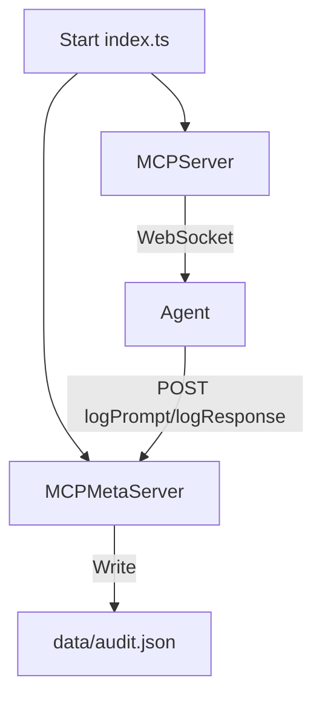

# MCP Audit Logging and Agentic Workflow

---

# Table of Contents

- [MCPMetaServer Setup and Agentic Workflow](#mcpmetaserver-setup-and-agentic-workflow)
- [MCP Server Startup and Conversational Logging (Unified Flow)](#mcp-server-startup-and-conversational-logging-unified-flow)
- [Selective Logging of Prompts and Responses (Cascade Agent Chat)](#selective-logging-of-prompts-and-responses-cascade-agent-chat)
- [MetaMCP (MCPMetaServer) Protocol and Usage](#metamcp-mcpmetaserver-protocol-and-usage)
- [Linting and Formatting](#linting-and-formatting)
- [Changelog and Audit Trail](#changelog-and-audit-trail)
- [See Also](#see-also)

---

## MCPMetaServer Setup and Agentic Workflow

See `src/mcp/SETUP.md` for full, step-by-step setup and troubleshooting instructions, including logic flow diagrams and best practices.

### Recommended: Start both the dev server and MCPMetaServer together using:

```sh
npm run start
```

### If you only want to run the MCPMetaServer (for testing or headless workflows):

```sh
npx ts-node src/mcp/server/index.ts
```

### Always ensure MCPMetaServer is running before submitting prompts or developing agent logic. All agent activity should be mediated via the MCPMetaServer for compliance and auditability.

---

## MCP Server Startup and Conversational Logging (Unified Flow)

### Unified Startup
To ensure full auditability and compliance, **run only this command to start both the WebSocket and REST audit servers:**

```bash
npx ts-node src/mcp/server/index.ts
```

- This launches:
  - The main MCP WebSocket server (port 8080, for protocol and integration tests)
  - The REST audit server (port 8081, for conversational logging, audit trail, and compliance)

### Logic Flow Diagram

```mermaid
graph TD
    A[Start index.ts] --> B[Start MCPServer (WebSocket, 8080)]
    A --> C[Import MCPMetaServer (Express app)]
    C --> D[Start REST Audit Server (8081)]
    E[Integration Test / Agent] -->|WebSocket| B
    E -->|POST logPrompt/logResponse| D
    D -->|Write| F[Audit Log (data/audit.json)]
```

### File Purposes
- `src/mcp/server/index.ts`: Unified entrypoint. Starts both servers. **Only run this file.**
- `src/mcp/server/MCPServer.ts`: WebSocket protocol server (8080).
- `src/mcp/server/MCPMetaServer.ts`: Express REST server (8081) for audit/compliance. Exported as an app, not run directly.

### Node.js Module System: CommonJS vs ESM

### What Changed?
- The project now uses **CommonJS** (the default Node.js module system) for all backend/server code.
- All local imports use the CommonJS-compatible form (no `.js` extensions, just the module name).
- This avoids ESM/TypeScript loader errors and makes development and onboarding easier.

### Why CommonJS?
- CommonJS is the most widely supported and reliable module system for Node.js projects.
- ESM (ECMAScript Modules) is more modern, but can be tricky to set up in Node.js, especially with TypeScript.
- For most backend/server code, there is no practical difference for developers.
- If you ever need to switch to ESM in the future (for package publishing or browser compatibility), see the [project history](#project-history) for migration notes.

### What Do I Need To Do?
- Use `import ... from '...'` for all imports, but do **not** add `.js` extensions to local files.
- Run the server with:
  ```bash
  npx ts-node src/mcp/server/index.ts
  ```
- You do **not** need to worry about ESM vs CommonJS unless you hit a specific package compatibility issue.

### Troubleshooting
If you see errors about unknown file extensions or ESM loaders, make sure:
- `package.json` contains: `"type": "commonjs"`
- `tsconfig.json` contains: `"module": "commonjs"`
- All local imports omit the `.js` extension (e.g., `import foo from './foo'` not `import foo from './foo.js'`)

### Onboarding & Compliance Notes
- **Never run MCPMetaServer.ts directly.** It is imported and started by index.ts.
- All conversational logging (user prompts, assistant responses) is POSTed to the REST server and written to `data/audit.json`.
- For integration tests and agentic logging, ensure both servers are running via the unified command above.
- See logic flow diagram above for audit/compliance traceability.

---

## MCP Server and MetaMCP: Dynamic, Auditable, and Future-Proof Setup

### Overview
This project implements a robust, auditable agent orchestration backend using:
- **MCPServer**: WebSocket protocol server for agent/assistant communication.
- **MCPMetaServer**: REST API for audit, compliance, project plan, guidelines, and live directory structure.
- **Unified Startup**: Both servers are started together for full traceability and onboarding simplicity.

### Dynamic Port Management
- **Why?**
  - Prevents port conflicts during tests and multi-instance dev.
  - Enables parallel test execution and CI reliability.
- **How?**
  - Set `port: 0` in `MCPConfig` to let the OS assign a free port.
  - After startup, call `server.getPort()` to retrieve the actual port.
  - All tests and clients should use this dynamic port for connections.
- **Best Practice**: Use `host: '127.0.0.1'` for local dev/tests. Use `'0.0.0.0'` for production (all interfaces).

### Error Handling & Auditability
- **Invalid messages** sent to MCPServer result in:
  - A JSON error response: `{ success: false, error: 'Invalid message format' }`
  - The connection is closed with code 1003 (unsupported data).
  - All such events are logged for audit.
- **All conversational and compliance events** are POSTed to `/logPrompt` and `/logResponse` on the REST server and written to `data/audit.json`.
- **MetaMCP** (MCPMetaServer) exposes REST endpoints for plan, guidelines, audit, README, and directory structure. See below for details.

### Logic Flow Diagram
```mermaid
graph TD
    A[Start index.ts] --> B[Start MCPServer (WebSocket, dynamic port)]
    A --> C[Import MCPMetaServer (Express app)]
    C --> D[Start REST Audit Server (8081)]
    E[Integration Test / Agent] -->|WebSocket| B
    E -->|POST logPrompt/logResponse| D
    D -->|Write| F[Audit Log (data/audit.json)]
```

### File Purposes (Audit-Ready)
- `src/mcp/server/index.ts`: **Unified entrypoint.** Starts both servers. Annotated for audit, config, and future extension.
- `src/mcp/server/MCPServer.ts`: WebSocket protocol server. Handles dynamic ports, message routing, and error/audit logic.
- `src/mcp/server/MCPMetaServer.ts`: REST server for audit/compliance, plan, guidelines, and directory structure. Exported as an app, not run directly.

### Using This MCP/MetaMCP Setup for Future Apps
1. **Clone/Copy the MCP setup (`src/mcp/server/`) and adapt `index.ts` config for your app.**
2. **For dynamic port assignment:**
   - Set `port: 0` in the config.
   - After startup, use `server.getPort()` for the actual port.
3. **For audit/compliance:**
   - Use the REST endpoints in MCPMetaServer for logging, plan/guideline management, and onboarding.
   - All conversational events should be POSTed to `/logPrompt` and `/logResponse`.
4. **MetaMCP (MCPMetaServer) endpoints:**
   - `GET/POST /plan` — Project plan management.
   - `GET/POST /guidelines` — Agent guidelines.
   - `GET/POST /audit` — Audit log access.
   - `POST /logPrompt`, `POST /logResponse` — Conversational logging.
   - `GET /readme` — Fetches the current README.
   - `GET /structure` — Returns live directory structure for agentic navigation.
5. **Extend as needed:**
   - Add new REST/WebSocket endpoints to MCPMetaServer for agent orchestration, push notifications, or real-time audit.
   - Use the provided directory watcher to trigger events or audits on file changes.

### Best Practices & Testing
- **All tests should use dynamic ports and connect to `127.0.0.1` for reliability.**
- **Audit logs and error responses should be asserted in tests for compliance.**
- **No inline mocks or hardcoded test data—use central test-utils/mocks.**
- **All config and startup logic is heavily annotated for future onboarding.**

### Project Structure (Updated)
- `src/mcp/server/index.ts`: Unified entrypoint. Starts both servers. **Only run this file.**
- `src/mcp/server/MCPServer.ts`: WebSocket protocol server (dynamic port).
- `src/mcp/server/MCPMetaServer.ts`: REST audit server (8081). Exported as an app, not run directly.
- `data/`: Audit log, plan, and guidelines JSON files.

---

## MCP Audit Log: Developer Tool, Not End-User Logging

**Purpose:**
- The audit log (`data/audit.json`) is strictly a developer tool for tracking agent/assistant development, debugging, and compliance audits.
- It is NOT intended for logging end-user application usage or production conversations.

**What Should Be Logged:**
- Compliance checks (naming, structure, test requirements)
- Manual/test actions for debugging or development
- Example conversational turns for agent/assistant development, e.g.:
  ```json
  {
    "type": "USER_PROMPT",
    "actor": "USER",
    "content": "What is the underwriting guideline for X?",
    "timestamp": "2025-04-15T14:00:00Z"
  }
  ```

**What Should NOT Be Logged:**
- Actual production user data or conversations (unless for explicit debugging/compliance, with privacy controls)
- Sensitive or personally identifiable information (PII)

**How to Use:**
- Use `/logPrompt` and `/logResponse` endpoints only in test/dev workflows, not in production user flows.
- Review the log as part of development, debugging, and compliance checks.
- For production analytics or audit, implement a separate, privacy-compliant logging solution as needed.

**Best Practices:**
- Always clarify in onboarding and documentation that the MCP audit log is a developer tool.
- Regularly review and clear logs to avoid accidental retention of sensitive data.
- Ensure all contributors understand the boundaries and intended use of this logging system.

---

## Selective Logging of Prompts and Responses (Cascade Agent Chat)

**Policy:**
- **All user prompts/instructions** in Cascade chat are logged in full to the MCP audit log (developer tool).
- **Assistant (Cascade) responses** are logged as a summary (first 200 characters) by default.
- **Full responses** are logged only if they contain errors, are flagged for audit, or you explicitly request it.

**Why:**
- Ensures traceability and auditability of developer instructions without bloating the audit log with every agent response.
- Keeps logs actionable, lightweight, and privacy-conscious.

**How to Integrate:**
- Add a logging hook to your Cascade chat system:
  - On every user prompt: POST to `/logPrompt` on MCPMetaServer.
  - On every assistant response: POST a summary to `/logResponse`, unless flagged for full logging.

**Code Sample:**
```typescript
import axios from 'axios';

const MCP_META_SERVER_URL = 'http://localhost:8081';

async function postToMCP(endpoint: string, payload: any) {
  try {
    await axios.post(`${MCP_META_SERVER_URL}${endpoint}`, payload);
  } catch (e) {
    console.error(`[MCP Logging] Failed to log to ${endpoint}:`, e);
  }
}

export async function logUserPrompt(prompt: string) {
  await postToMCP('/logPrompt', {
    type: 'USER_PROMPT',
    actor: 'USER',
    content: prompt,
    timestamp: new Date().toISOString()
  });
}

export async function logAssistantResponse(response: string, opts?: { forceFull?: boolean }) {
  const shouldLogFull = opts?.forceFull || /error|fail|exception/i.test(response);
  await postToMCP('/logResponse', {
    type: 'ASSISTANT_RESPONSE',
    actor: 'Cascade',
    content: shouldLogFull ? response : response.slice(0, 200) + (response.length > 200 ? '...' : ''),
    fullLogged: shouldLogFull,
    timestamp: new Date().toISOString()
  });
}
```

**Best Practices:**
- Log all user prompts in full for audit/compliance.
- Log responses as summaries unless full detail is required.
- Reference this policy in onboarding and compliance docs.

---

## MetaMCP (MCPMetaServer) Protocol and Usage

- **Purpose**: Central REST API for audit, plan, guidelines, onboarding, and agent orchestration.
- **Key Endpoints:**
  - `GET/POST /plan` — Get/set the current project plan.
  - `GET/POST /guidelines` — Get/set agent guidelines.
  - `GET/POST /audit` — Get/append audit log entries.
  - `POST /logPrompt`, `POST /logResponse` — Log user/assistant conversational turns.
  - `GET /readme` — Fetches the current README.
  - `GET /structure` — Returns live directory structure for agentic navigation.
- **WebSocket (future):**
  - Port 8090, for real-time push notifications and agent sync.
- **Directory Watcher:**
  - Watches `src/`, `data/`, and `README.md` for changes (future: triggers agentic events or audits).

### Example: Starting Both Servers
```bash
npx ts-node src/mcp/server/index.ts
```

### Example: Dynamic Port Usage in Your App
```typescript
const config = { port: 0, host: '127.0.0.1', ... };
const server = new MCPServer(config);
server.start();
// Wait for 'started' event, then:
const actualPort = server.getPort();
const ws = new WebSocket(`ws://127.0.0.1:${actualPort}`);
```

### Example: Logging a User Prompt
```bash
curl -X POST http://localhost:8081/logPrompt -H 'Content-Type: application/json' -d '{ "content": "What is the underwriting guideline for X?" }'
```

---

## Logic Flow: MCP/MetaMCP Startup and Audit



---

## File List and Purposes (for Audit/Blueprint)
- `src/mcp/server/index.ts`: Unified startup, config, and audit entrypoint.
- `src/mcp/server/MCPServer.ts`: WebSocket server, dynamic port, audit/error logic.
- `src/mcp/server/MCPMetaServer.ts`: REST/audit server, plan/guidelines, onboarding.
- `data/audit.json`: Audit log of all conversational and compliance events.
- `data/plan.json`: Current project plan (editable via REST).
- `data/guidelines.json`: Current agent guidelines (editable via REST).

---

## Extending This System for Your Own App
- **Copy/adapt the MCP/MetaMCP setup as your backend foundation.**
- **Use dynamic port assignment for test/dev reliability.**
- **Leverage the REST audit endpoints for compliance and onboarding.**
- **Extend with new endpoints, directory watchers, or agentic protocols as needed.**
- **Heavily annotate all config and startup logic for future maintainers.**

---

## Changelog and Audit Trail

- All major changes, architectural decisions, and workflow updates are documented in this section.
- See the audit log (`data/audit.json`) for a full machine-readable trail of agentic and compliance actions.
- For details on selective logging and startup, see the sections above and `src/mcp/SETUP.md`.

---

## See Also

- `src/__tests__/README.md` for test structure and best practices.
- All config and logic is heavily annotated in code for onboarding and audit.

---

## Linting and Formatting

- This project uses ESLint and markdownlint for code and documentation quality.
- To check/fix markdown formatting issues, run:

```sh
npx markdownlint-cli2 "**/*.md"
```

- To check/fix code linting issues, run:

```sh
npm run lint
```

---
