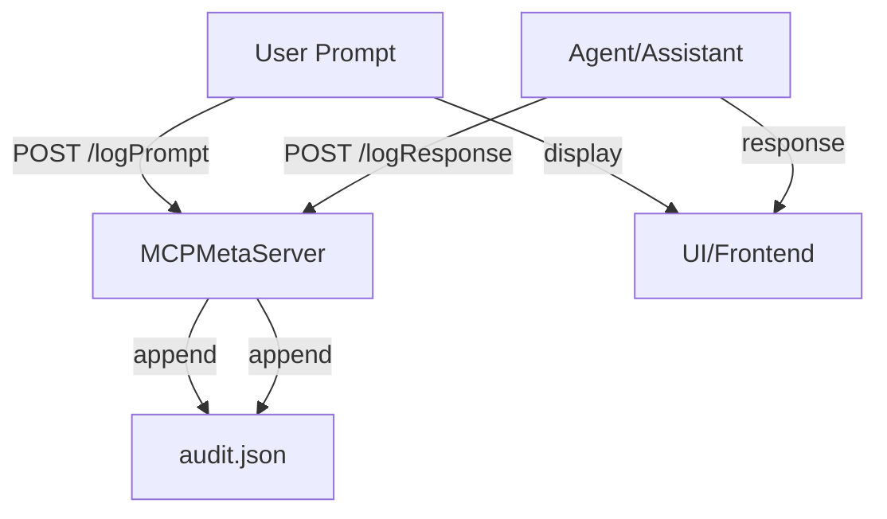

# MCPMetaServer Setup and Agentic Workflow

## Overview

The MCPMetaServer is the central REST API and audit log for all agentic development and compliance workflows in this project. All agent/assistant actions, prompts, and responses should be mediated through the MCPMetaServer for full auditability and reproducibility.

## Getting Started

### Starting the Development Environment

To launch both the dev server (UI) and the MCPMetaServer for a seamless, auditable workflow, use the following command:

```sh
npm run start
```

This uses `concurrently` to run both `vite` (the dev UI) and `npx ts-node src/mcp/server/index.ts` (the MCPMetaServer).

Always use this command when starting a new agentic development session.

### Starting the MCPMetaServer Only

If you only want to run the MCPMetaServer (for testing or headless workflows), use the following command:

```sh
npx ts-node src/mcp/server/index.ts
```

### Troubleshooting

- If you see errors about `--loader ts-node/esm`, use the manual command above without the loader flag.
- Make sure your Node.js version is compatible with your local `ts-node`.
- If you see `command not found: ts-node`, use `npx ts-node ...`.
- The MCPMetaServer REST API will be available at `http://localhost:8081`.

## Logging Policy

- All user prompts/instructions are logged in full to the audit log.
- Assistant responses are logged as a summary (first 200 chars) by default.
- Full responses are logged only if flagged or if they contain errors.
- See the main README for code samples and integration details.

## Logic Flow Diagram



## Best Practices

- Always start the MCPMetaServer before sending prompts or developing agent logic.
- Never bypass the audit log for agentic actions.
- Reference this file and the README for onboarding, compliance, and troubleshooting.

## Linting and Formatting

- Use markdownlint and ESLint to keep documentation and code clean.
- For markdown files, run:

```sh
npx markdownlint-cli2 "**/*.md"
```

- For code linting, run:

```sh
npm run lint
```

## Changelog and Audit Trail

- Major setup, workflow, and compliance changes are documented here and in the main README.
- For a full machine-readable audit trail, see `data/audit.json`.

---

_Last updated: 2025-04-15_
